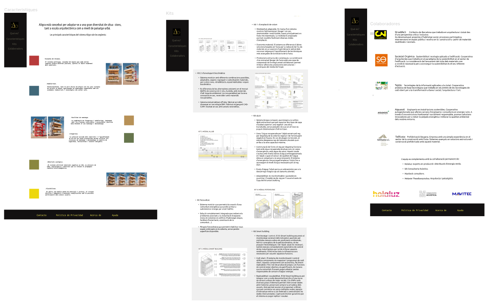

# ALIGRA
*Es uno de los proyectos ganadores de la convocatoria  para la “Regeneración de edificios de viviendas con sistemas innovadores sostenibles” de la fundación BitHábitat.

La propuesta se basa en una estructura de madera con cierres multicapa que mejora las prestaciones de edificaciones existentes, como el mal aislamiento, el déficit de espacios comunitarios o la dimensión pequeña. El sistema, como un mecano, apuesta por la ligereza, la facilidad de montaje, los materiales ecológicos y la flexibilidad.
## ¿Quienes somos?
Aligra, un proyecto presentado por el equipo formado por Straddle3, Societat Orgànica, Aiguasol, Tallfusta y Tejido, fue valorado en primera posición por el comité de selección del reto.


### Organización
División del proyecto y estado final de las tareas:


## :hammer:Tecnologías y Herramientas Utilizadas
<div align=""> 
  
  


</div>

## Instalación

- Clona o descarga el repositorio del proyecto en tu máquina local.
```
https://github.com/Manuraptor/amunt-p1-aligra.git
```
- O bién consultalo desde la app de Vercel.
...
- https://vercel.com/manuraptor/amunt-p1-aligra

### Para los tests
- Una vez clonado el repositorio en la terminal de tu editor de código con el proyecto.
```
npm install
```
- Para ejecutarlos
```
npm run test
```
## Figma

<br>

<br>



## Colaboradores
| [<br><sub>Maribel</sub>](https://github.com/mari19-83) | [<br><sub>Irina</sub>](https://github.com/Irina-Ichim) | [<br><sub>Silvana</sub>](https://github.com/Manuraptor) | [<br><sub>Telma</sub>](https://github.com/mgblanco10) | [<br><sub>Manuel</sub>](https://github.com/Manuraptor) | 
|:------------------------------------------------------------------------------------------------------------------------------:|:---------------------------------------------------------------------------------------------------------------------------------:|:----------------------------------------------------------------------------------------------------------------------------------:|:--------------------------------------------------------------------------------------------------------------------------------:|:---------------------------------------------------------------------------------------------------------------------------------:|


